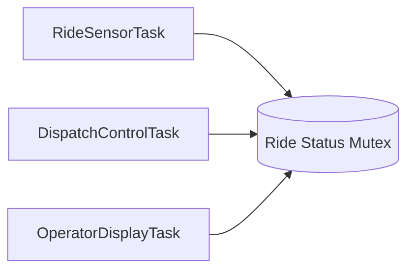

# Real-Time Scheduling and Task Design

## Part A — Read a Task Table

### Task Table

| Task | Function | Period (ms) | WCET (ms) | Deadline (ms) |
|------|----------|-------------|-----------|---------------|
| T1 | Sensor Read | 10 | 1.0 | 10 |
| T2 | Control Loop | 20 | 3.0 | 20 |
| T3 | Comms Send | 50 | 5.0 | 50 |
| T4 | Logging | 100 | 10.0 | 100 |

---

### CPU Fraction (Utilization)

Utilization is calculated as:

U = WCET / Period

| Task | Calculation | CPU Fraction |
|--------|-------------|-------------|
| T1 | 1 / 10 | 0.10 |
| T2 | 3 / 20 | 0.15 |
| T3 | 5 / 50 | 0.10 |
| T4 | 10 / 100 | 0.10 |

Total Utilization:

U = 0.10 + 0.15 + 0.10 + 0.10 = 0.45

Total CPU utilization = **45%**

Idle Fraction:

Idle = 1.00 - 0.45 = 0.55

Idle CPU fraction = **55%**

---

### Priority Ranking

#### Highest to Lowest Priority

1. T1 – Sensor Read
2. T2 – Control Loop
3. T3 – Comms Send
4. T4 – Logging

#### Rule Used

I used **Rate Monotonic Scheduling (RMS)**, where tasks with shorter periods are assigned higher priorities because they must execute more frequently.

#### Priority Bands

| Task | Priority Band | Justification |
|--------|--------------|--------------|
| T1 Sensor Read | 14 | Sensor acquisition is time-sensitive and belongs in the sensor/IPC range. |
| T2 Control Loop | 17 | Control loops directly affect system behavior and belong in the control range. |
| T3 Comms Send | 8 | Communication tasks are important but less critical than sensing and control. |
| T4 Logging | 3 | Logging is housekeeping work and can tolerate delays. |

---

### Yield Semantics

T2 should use **vTaskDelayUntil()**.

A periodic control loop should execute at precise intervals. Using `vTaskDelay()` causes drift because the delay starts after the task finishes executing. Small variations in execution time accumulate and shift the task schedule over time.

`vTaskDelayUntil()` uses a fixed reference time for each release, preventing drift and minimizing phase error. This ensures the control loop runs every 20 ms as intended.

---

### State-Machine Trace for T1

After finishing a sensor read:

| Current State | Event/API | Next State |
|--------------|-----------|------------|
| Running | Calls vTaskDelayUntil() | Blocked |
| Blocked | Delay expires | Ready |
| Ready | Scheduler selects task | Running |

#### Full Cycle

1. T1 starts in the Running state.
2. T1 finishes reading the sensor.
3. T1 calls `vTaskDelayUntil()`.
4. T1 enters the Blocked state while waiting for its next release time.
5. The delay expires and the kernel moves T1 to the Ready state.
6. The scheduler selects T1 because it has the highest priority among ready tasks.
7. T1 returns to the Running state and performs another sensor read.

---

## Part B — xTaskCreate Defended

### Task Creation

```c
xTaskCreate(
    ControlTask,
    "Control",
    1024,
    NULL,
    17,
    NULL
);
```

### Parameter Defense

**ControlTask**

This is the function that implements the periodic control-loop behavior.

**"Control"**

The task name makes debugging and trace output easier to understand.

**1024**

I estimated worst-case stack depth by considering local variables, nested function calls, FreeRTOS overhead, and future expansion. A stack size of 1024 words provides a safe margin.

**NULL**

The task does not require any startup parameters because all configuration information is stored elsewhere.

**17**

Priority 17 places the task in the control band and ensures it runs immediately after the sensor task when needed.

**NULL**

A task handle is not required because the application does not need to suspend, resume, or delete the task later.

---

## Part C — Theme Park Ride Controller System

### Task Table

| Task Name | Purpose | Period (ms) | WCET (ms) | Deadline (ms) | Priority |
|------------|---------|-------------|-----------|---------------|----------|
| RideSensorTask | Read ride safety sensors | 10 | 1 | 10 | 18 |
| DispatchControlTask | Determine ride dispatch status | 20 | 3 | 20 | 17 |
| OperatorDisplayTask | Update operator webpage | 100 | 8 | 100 | 6 |

---

### Priority Justification

#### RideSensorTask (Priority 18)

This task monitors ride safety sensors and must run quickly because ride safety depends on current sensor information.

#### DispatchControlTask (Priority 17)

This task decides whether the ride can dispatch based on sensor data. It is slightly lower than the sensor task because it depends on fresh sensor readings.

#### OperatorDisplayTask (Priority 6)

The operator webpage provides status information but does not directly affect ride safety, so it can run at a lower priority.

---

### Shared Resource

#### Resource

```c
rideStatus
```

#### Tasks Using It

- RideSensorTask writes sensor data.
- OperatorDisplayTask reads sensor data.

#### Protection Method

A mutex protects access to the shared structure, preventing race conditions and ensuring consistent data.

---

### Concurrency Diagram



---

## Part D — Industry Anchor (FreeRTOS)

FreeRTOS uses a fixed-priority preemptive scheduling model. Tasks are assigned priorities, and the highest-priority ready task always executes. Optional time slicing can be enabled for tasks with equal priorities.

FreeRTOS is commonly used in embedded systems such as IoT devices, industrial controllers, robotics, consumer electronics, and ESP32-based projects. Its small memory footprint and portability make it a popular choice for microcontrollers.

One major difference from systems such as AUTOSAR or ARINC 653 is that FreeRTOS does not provide built-in time partitioning. Instead, tasks share CPU time according to their priorities. This keeps the kernel lightweight and efficient for embedded devices while sacrificing some of the temporal isolation required in highly safety-critical systems.
